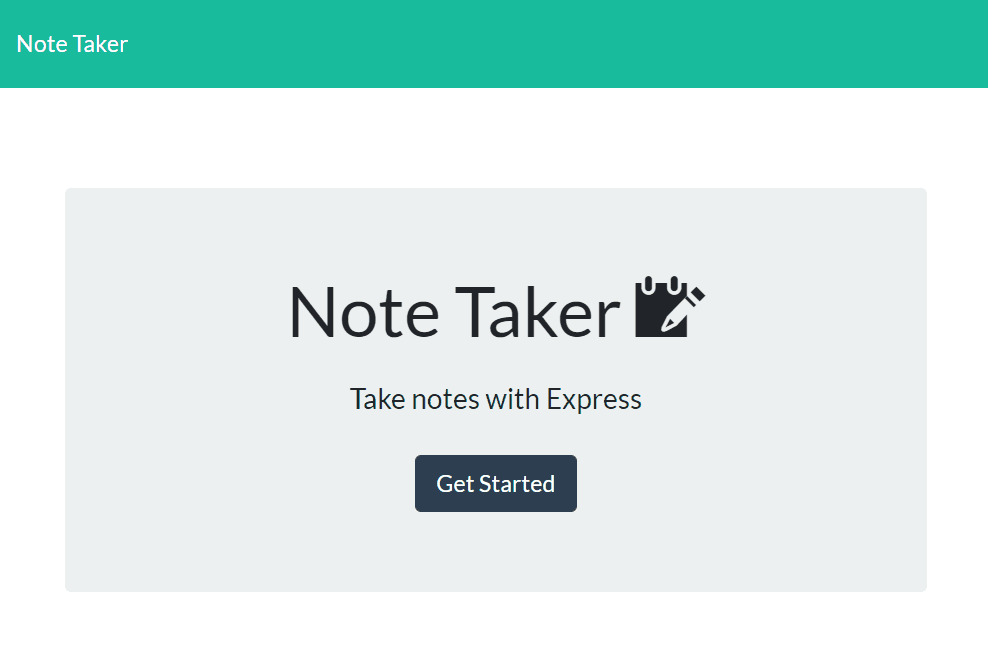

# Note Taker
Express.js (web application server framework)

## Description 
  

The task was to create an application that can be used to write, save and delete notes. The application needed to have an express backend and save and retrieve note data from a JSON file. A frontend for the application was given and I built the backend and connected the two.

## Table of Contents
1. [Installation](#Installation)
2. [Usage](#Usage)
3. [Technologies](#Technologies)
4. [Credits](#Credits)
5. [Contributing](#Contributing)
6. [Licence](#License)

## Installation
1. Create a basic Express server
2. Create HTML routes and check they are working. It took a while to sort through the directory structure to get the links and paths to work. I also needed to add 
    `app.use(express.static('public'))` and `app.use(express.static('db'))` **server.js** to link Javascript and CSS.
3. Create API routes - first GET was straight forward, POST and DELETE required required google fu and help with thinking it through. As the frontend was written for me, it was hard to grasp how it all works together.
4. Testing functionality and cleaning code.

## Usage
To use this application open the application at the following URL - 

The URL of the git hub repository is https://github.com/CazB67/note-taker

The following GIF shows the application's functionality.

## Technologies
NPM, Node js, Express js, fs module

## Credits
- Team at UWA Coding Bootcamp

## Contributing

## License
  